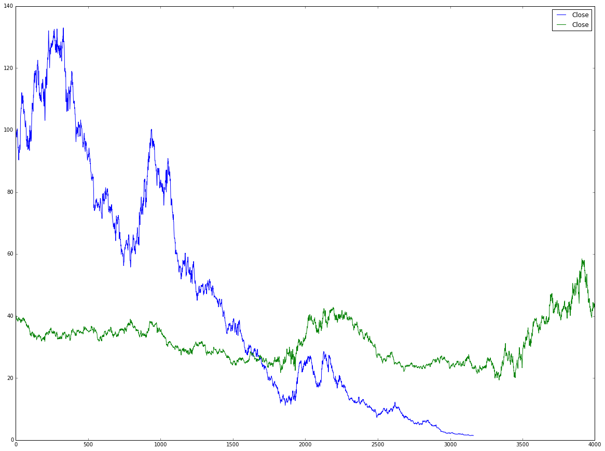
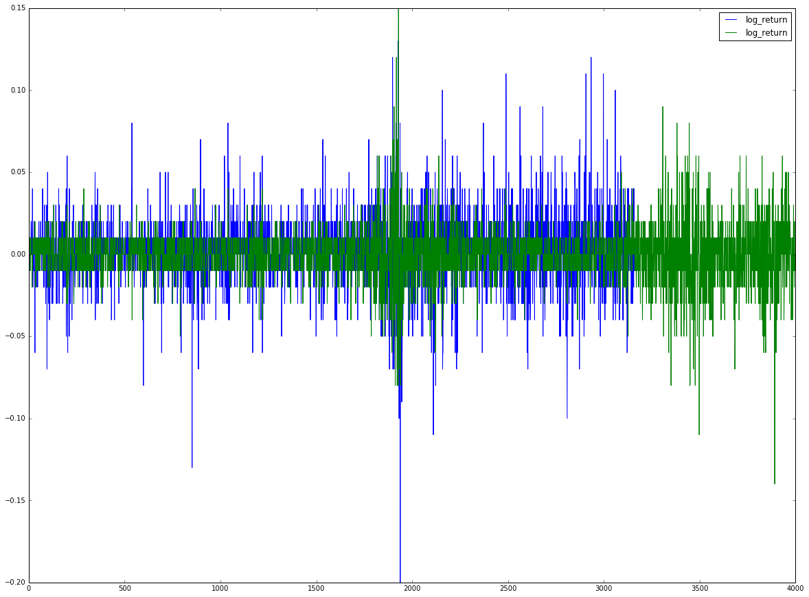
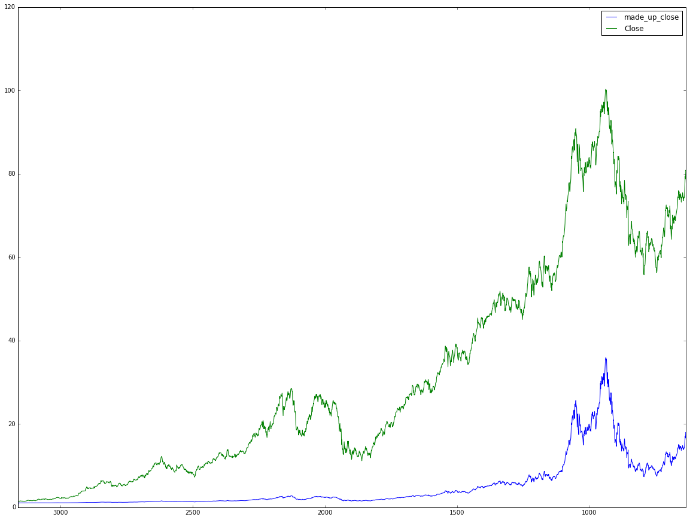
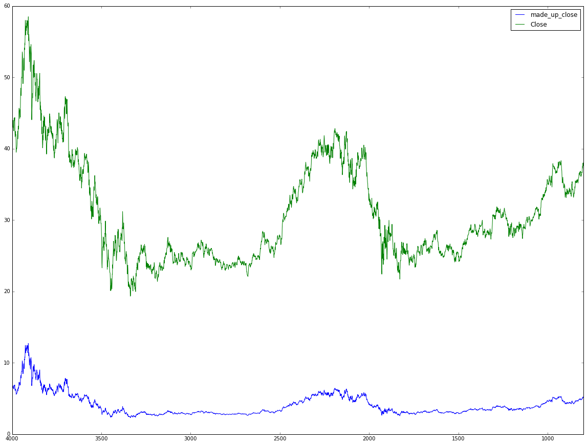

# Stock Prediction Using RNN and Deep Learning

For this excersise i have chosen to work with stocks, wich i am very familier with, in order to see if i could create a basis for a prediction mechanism ( even if it would be very limited for now ) in order to experiment with this idea that might continue into a thesis later on.
The stocks i have chosen to work with are aapl (Apple inc.) and t (AT&T), as they are both pretty good on stability.
The purpous of this excersise will be to evaluate how good a prediction can a simple deep learning machine come up with using the very basic publicly available stock ticker data.

The data we are provided with for each of the stocks has been scraped from google finance and has the following fields:
Date    Open	High	Low	Close

Let's begin:


### importing 
For the task at hand, i have chosen to work with tensorflow, mainly for the experience and to learn one of the newer
libreries out there.
in addition, i am using pandas for data manipulation and numpy as a linear algebra library.
Also, i will plot all the relavent data with matplotlib.


```python
%matplotlib inline

import pandas as pd
from pandas.tools.plotting import autocorrelation_plot
from pandas.tools.plotting import scatter_matrix

import numpy as np

import matplotlib.pyplot as plt

import tensorflow as tf
from tensorflow.python.ops import rnn, rnn_cell
```


### Pre process
i will begin with removing the 'date' column as it will have no effect on the results. 
Also, the data we got is inverse, as the latest date was displayed first. Let's invert that as well.


```python
# Remove unneccesery 'date' collumn and reverse the values so i goes forward in time

aapl = pd.read_csv('/Users/orpaz/Desktop/machine_learning/stock_prediction/aapl.csv')
aapl = aapl.drop(aapl.columns[[0,5]], axis=1)
aapl = aapl.iloc[::-1]

t = pd.read_csv('/Users/orpaz/Desktop/machine_learning/stock_prediction/t.csv')
t = t.drop(t.columns[[0,5]], axis=1)
t = t.iloc[::-1]
t, aapl
```


    (       Open   High    Low  Close
     3999  44.44  44.44  43.25  43.62
     3998  44.12  45.56  43.00  43.00
     3997  43.25  44.00  42.44  43.00
     3996  42.75  43.69  42.69  43.19
     3995  43.44  44.31  43.38  44.00
     3994  43.94  44.12  43.12  43.12
     3993  43.50  43.69  42.62  42.81
     3992  42.25  43.19  42.19  42.50
     3991  42.56  43.44  42.31  42.56
     3990  42.62  44.00  42.56  43.69
     3989  44.00  44.75  43.81  44.31
     3988  44.38  44.50  43.75  44.00
     3987  44.00  44.12  43.50  43.94
     3986  43.38  44.56  43.38  44.38
     3985  43.62  43.88  42.00  42.50
     3984  42.69  42.88  41.31  41.69
     3983  41.81  42.50  41.81  42.31
     3982  42.62  43.50  42.38  42.44
     3981  42.06  42.62  41.56  41.88
     3980  42.38  42.69  42.00  42.00
     3979  42.50  42.62  41.00  41.19
     3978  40.75  40.88  38.75  39.50
     3977  39.56  39.94  38.44  39.88
     3976  40.19  40.25  39.44  40.06
     3975  40.31  40.38  39.69  40.00
     3974  39.94  40.62  39.88  40.19
     3973  40.62  41.12  40.38  40.50
     3972  40.75  41.19  40.31  41.19
     3971   0.00  42.62  41.31  41.44
     3970  41.94  43.06  41.81  42.44
     ...     ...    ...    ...    ...
     29    38.87  39.15  38.78  39.10
     28    39.02  39.08  38.68  38.91
     27    38.75  39.00  38.58  38.88
     26    38.94  38.99  38.66  38.74
     25    38.78  38.99  38.47  38.99
     24    38.99  39.11  38.83  38.86
     23    39.02  39.38  38.98  39.31
     22    39.27  39.34  39.02  39.18
     21    39.30  39.67  39.20  39.55
     20    39.49  39.52  39.11  39.15
     19    38.95  39.30  38.90  39.28
     18    39.24  39.33  39.00  39.11
     17    39.09  39.15  38.27  38.45
     16    38.27  38.47  37.77  38.44
     15    38.64  38.68  38.31  38.45
     14    38.48  38.51  38.26  38.32
     13    38.46  38.56  38.39  38.50
     12    38.67  38.72  38.45  38.62
     11    38.69  38.99  38.64  38.84
     10    38.83  38.99  38.60  38.99
     9     39.03  39.20  38.94  39.15
     8     39.10  39.12  38.61  38.73
     7     38.73  38.84  38.58  38.84
     6     38.97  39.27  38.93  39.21
     5     39.22  39.48  39.18  39.34
     4     39.37  39.89  39.33  39.79
     3     39.72  39.87  39.64  39.86
     2     39.83  40.17  39.65  40.09
     1     39.95  40.53  39.88  40.33
     0     40.19  40.46  40.13  40.19
     
     [4000 rows x 4 columns],        Open    High    Low   Close
     3161   1.52    1.52   1.45    1.46
     3160   1.47    1.48   1.45    1.46
     3159   1.46    1.51   1.44    1.46
     3158   1.45    1.47   1.42    1.45
     3157   1.46    1.52   1.46    1.51
     3156   1.52    1.52   1.47    1.48
     3155   1.49    1.51   1.45    1.48
     3154   1.48    1.50   1.47    1.49
     3153   1.50    1.56   1.50    1.55
     3152   1.54    1.56   1.53    1.54
     3151   1.54    1.56   1.50    1.50
     3150   1.50    1.51   1.48    1.51
     3149   1.49    1.51   1.48    1.49
     3148   1.48    1.51   1.46    1.50
     3147   1.51    1.52   1.46    1.46
     3146   1.46    1.47   1.43    1.46
     3145   1.45    1.52   1.44    1.52
     3144   1.51    1.52   1.48    1.49
     3143   1.53    1.54   1.43    1.44
     3142   1.44    1.46   1.43    1.44
     3141   1.43    1.44   1.41    1.42
     3140   1.42    1.44   1.42    1.43
     3139   1.44    1.46   1.40    1.41
     3138   1.40    1.42   1.38    1.42
     3137   1.42    1.42   1.40    1.42
     3136   1.41    1.47   1.40    1.46
     3135   1.46    1.49   1.45    1.48
     3134   1.49    1.51   1.49    1.51
     3133   1.51    1.54   1.51    1.52
     3132   1.52    1.54   1.51    1.53
     ...     ...     ...    ...     ...
     29    93.96   94.08  92.40   93.64
     28    94.20   95.74  93.68   95.18
     27    95.20   95.90  93.82   94.19
     26    94.00   94.07  92.68   93.24
     25    93.37   93.45  91.85   92.72
     24    93.00   93.77  92.59   92.79
     23    93.33   93.57  92.11   93.42
     22    93.48   93.57  92.46   92.51
     21    92.72   92.78  89.47   90.34
     20    90.00   91.67  90.00   90.52
     19    92.39   94.39  91.65   93.88
     18    94.55   94.70  93.01   93.49
     17    94.16   95.21  93.89   94.56
     16    94.64   94.64  93.57   94.20
     15    94.64   95.43  94.52   95.22
     14    95.87   97.19  95.67   96.43
     13    97.22   98.09  96.84   97.90
     12    98.67   99.74  98.11   99.62
     11    99.68  100.73  98.64  100.41
     10    99.44  100.47  99.24  100.35
     9     99.60  100.40  98.82   99.86
     8     99.02   99.54  98.33   98.46
     7     97.60   97.84  96.63   97.72
     6     97.79   98.27  97.45   97.92
     5     97.99  101.89  97.55   98.63
     4     99.25   99.87  98.96   99.03
     3     99.02   99.56  98.68   98.94
     2     98.50   99.99  98.46   99.65
     1     98.53   99.35  98.48   98.83
     0     98.69   99.12  97.10   97.34
     
     [3162 rows x 4 columns])


### Adding my Predicator
For the next step, i will be adding a predicator to be predicted by the model.
Since percentage return in not evenly distributed, and i cannot predict the next 'Close' of a stock without some 
normalization to the sequence, i will use 'log returns' as a predicator. Log return are the normalization of the change between a day and the previuos day.

Read about log returns here:  [Why log returns?](https://quantivity.wordpress.com/2011/02/21/why-log-returns/)


```python
# Add log returns to be predicted and round reasonably so we can use classicfication.

aapl['log_return'] = np.log(aapl['Close']/aapl['Close'].shift()).round(2)

t['log_return'] = np.log(t['Close']/t['Close'].shift()).round(2)
```


```python
aapl.describe()
```


<div>
<table border="1" class="dataframe">
  <thead>
    <tr style="text-align: right;">
      <th></th>
      <th>Open</th>
      <th>High</th>
      <th>Low</th>
      <th>Close</th>
      <th>log_return</th>
    </tr>
  </thead>
  <tbody>
    <tr>
      <th>count</th>
      <td>3162.000000</td>
      <td>3162.000000</td>
      <td>3162.000000</td>
      <td>3162.000000</td>
      <td>3161.000000</td>
    </tr>
    <tr>
      <th>mean</th>
      <td>45.764548</td>
      <td>46.219330</td>
      <td>45.249608</td>
      <td>45.741379</td>
      <td>0.001370</td>
    </tr>
    <tr>
      <th>std</th>
      <td>38.238960</td>
      <td>38.548846</td>
      <td>37.887143</td>
      <td>38.216548</td>
      <td>0.022349</td>
    </tr>
    <tr>
      <th>min</th>
      <td>1.400000</td>
      <td>1.420000</td>
      <td>1.380000</td>
      <td>1.410000</td>
      <td>-0.200000</td>
    </tr>
    <tr>
      <th>25%</th>
      <td>12.250000</td>
      <td>12.380000</td>
      <td>12.092500</td>
      <td>12.222500</td>
      <td>-0.010000</td>
    </tr>
    <tr>
      <th>50%</th>
      <td>30.645000</td>
      <td>30.770000</td>
      <td>30.095000</td>
      <td>30.600000</td>
      <td>0.000000</td>
    </tr>
    <tr>
      <th>75%</th>
      <td>76.380000</td>
      <td>77.062500</td>
      <td>75.590000</td>
      <td>76.177500</td>
      <td>0.010000</td>
    </tr>
    <tr>
      <th>max</th>
      <td>134.460000</td>
      <td>134.540000</td>
      <td>131.400000</td>
      <td>133.000000</td>
      <td>0.130000</td>
    </tr>
  </tbody>
</table>
</div>


```python
t.describe()
```


<div>
<table border="1" class="dataframe">
  <thead>
    <tr style="text-align: right;">
      <th></th>
      <th>Open</th>
      <th>High</th>
      <th>Low</th>
      <th>Close</th>
      <th>log_return</th>
    </tr>
  </thead>
  <tbody>
    <tr>
      <th>count</th>
      <td>4000.000000</td>
      <td>4000.000000</td>
      <td>4000.000000</td>
      <td>4000.000000</td>
      <td>3999.000000</td>
    </tr>
    <tr>
      <th>mean</th>
      <td>31.849542</td>
      <td>32.182503</td>
      <td>31.521808</td>
      <td>31.855657</td>
      <td>0.000068</td>
    </tr>
    <tr>
      <th>std</th>
      <td>6.761805</td>
      <td>6.841542</td>
      <td>6.665063</td>
      <td>6.762795</td>
      <td>0.016541</td>
    </tr>
    <tr>
      <th>min</th>
      <td>0.000000</td>
      <td>19.500000</td>
      <td>18.850000</td>
      <td>19.340000</td>
      <td>-0.140000</td>
    </tr>
    <tr>
      <th>25%</th>
      <td>25.870000</td>
      <td>26.140000</td>
      <td>25.570000</td>
      <td>25.887500</td>
      <td>-0.010000</td>
    </tr>
    <tr>
      <th>50%</th>
      <td>31.585000</td>
      <td>31.920000</td>
      <td>31.315000</td>
      <td>31.640000</td>
      <td>0.000000</td>
    </tr>
    <tr>
      <th>75%</th>
      <td>35.932500</td>
      <td>36.230000</td>
      <td>35.610000</td>
      <td>35.917500</td>
      <td>0.010000</td>
    </tr>
    <tr>
      <th>max</th>
      <td>58.120000</td>
      <td>59.000000</td>
      <td>57.440000</td>
      <td>58.500000</td>
      <td>0.150000</td>
    </tr>
  </tbody>
</table>
</div>


### The two stocks side by side


```python
_ = pd.concat([aapl['Close'], t['Close']], axis=1).plot(figsize=(20, 15))
```





### Log returns
Although the two stock are not really connected to each other, as we can see in the above grahp, their log returns will
be somewhat connected. 
Since the two stocks are in the same stock exchange they will have little siilarity in the normalized version of the 
movement.
The log return plot:


```python
_ = pd.concat([aapl['log_return'],
  t['log_return']], axis=1).plot(figsize=(20, 15))
```





#### Pre Processing the labels
For prediction purposses, i will split the log returns into categories to be predicted by the machine,
i am rounding the log returns to the nearest 100th and let these be our classes.
Also i normalize for tensorflow to be happy.


```python
# Seperate data into predicators and classes
# Since i need to create classes based on the values in th log return, i let python create the labels for me...
# also normalize all columns for TensorFlow

predictors_tf = aapl[aapl.columns[:4]]
for c in predictors_tf.columns:
    predictors_tf[c] = predictors_tf[c] / max(predictors_tf[c])

temp_classes_tf = aapl[aapl.columns[4:]].fillna(0)

classes_tf = pd.DataFrame()

for i, x in temp_classes_tf.iterrows():
    classes_tf.set_value(i, str(float(x)), 1)
    
classes_tf = classes_tf.fillna(0)
##########################
##########################


predictors_tf2 = t[t.columns[:4]]
for c in predictors_tf2.columns:
    predictors_tf2[c] = predictors_tf2[c] / max(predictors_tf2[c])

temp_classes_tf2 = t[t.columns[4:]].fillna(0)

classes_tf2 = pd.DataFrame()

for i, x in temp_classes_tf2.iterrows():
    classes_tf2.set_value(i, str(float(x)), 1)
    
classes_tf2 = classes_tf2.fillna(0)

###########################
classes_tf, classes_tf2


```

    /usr/local/Cellar/python3/3.5.1/Frameworks/Python.framework/Versions/3.5/lib/python3.5/site-packages/ipykernel/__main__.py:7: SettingWithCopyWarning: 
    A value is trying to be set on a copy of a slice from a DataFrame.
    Try using .loc[row_indexer,col_indexer] = value instead
    
    See the caveats in the documentation: http://pandas.pydata.org/pandas-docs/stable/indexing.html#indexing-view-versus-copy
    /usr/local/Cellar/python3/3.5.1/Frameworks/Python.framework/Versions/3.5/lib/python3.5/site-packages/ipykernel/__main__.py:23: SettingWithCopyWarning: 
    A value is trying to be set on a copy of a slice from a DataFrame.
    Try using .loc[row_indexer,col_indexer] = value instead
    
    See the caveats in the documentation: http://pandas.pydata.org/pandas-docs/stable/indexing.html#indexing-view-versus-copy


    (      0.0  -0.01  0.04  -0.02  0.01  -0.03  0.03  0.02  -0.06  -0.04  ...    \
     3161    1      0     0      0     0      0     0     0      0      0  ...     
     3160    1      0     0      0     0      0     0     0      0      0  ...     
     3159    1      0     0      0     0      0     0     0      0      0  ...     
     3158    0      1     0      0     0      0     0     0      0      0  ...     
     3157    0      0     1      0     0      0     0     0      0      0  ...     
     3156    0      0     0      1     0      0     0     0      0      0  ...     
     3155    1      0     0      0     0      0     0     0      0      0  ...     
     3154    0      0     0      0     1      0     0     0      0      0  ...     
     3153    0      0     1      0     0      0     0     0      0      0  ...     
     3152    0      1     0      0     0      0     0     0      0      0  ...     
     3151    0      0     0      0     0      1     0     0      0      0  ...     
     3150    0      0     0      0     1      0     0     0      0      0  ...     
     3149    0      1     0      0     0      0     0     0      0      0  ...     
     3148    0      0     0      0     1      0     0     0      0      0  ...     
     3147    0      0     0      0     0      1     0     0      0      0  ...     
     3146    1      0     0      0     0      0     0     0      0      0  ...     
     3145    0      0     1      0     0      0     0     0      0      0  ...     
     3144    0      0     0      1     0      0     0     0      0      0  ...     
     3143    0      0     0      0     0      1     0     0      0      0  ...     
     3142    1      0     0      0     0      0     0     0      0      0  ...     
     3141    0      1     0      0     0      0     0     0      0      0  ...     
     3140    0      0     0      0     1      0     0     0      0      0  ...     
     3139    0      1     0      0     0      0     0     0      0      0  ...     
     3138    0      0     0      0     1      0     0     0      0      0  ...     
     3137    1      0     0      0     0      0     0     0      0      0  ...     
     3136    0      0     0      0     0      0     1     0      0      0  ...     
     3135    0      0     0      0     1      0     0     0      0      0  ...     
     3134    0      0     0      0     0      0     0     1      0      0  ...     
     3133    0      0     0      0     1      0     0     0      0      0  ...     
     3132    0      0     0      0     1      0     0     0      0      0  ...     
     ...   ...    ...   ...    ...   ...    ...   ...   ...    ...    ...  ...     
     29      0      0     0      0     0      0     0     0      0      0  ...     
     28      0      0     0      0     0      0     0     1      0      0  ...     
     27      0      1     0      0     0      0     0     0      0      0  ...     
     26      0      1     0      0     0      0     0     0      0      0  ...     
     25      0      1     0      0     0      0     0     0      0      0  ...     
     24      1      0     0      0     0      0     0     0      0      0  ...     
     23      0      0     0      0     1      0     0     0      0      0  ...     
     22      0      1     0      0     0      0     0     0      0      0  ...     
     21      0      0     0      1     0      0     0     0      0      0  ...     
     20      1      0     0      0     0      0     0     0      0      0  ...     
     19      0      0     1      0     0      0     0     0      0      0  ...     
     18      0      0     0      0     0      0     0     0      0      0  ...     
     17      0      0     0      0     1      0     0     0      0      0  ...     
     16      0      0     0      0     0      0     0     0      0      0  ...     
     15      0      0     0      0     1      0     0     0      0      0  ...     
     14      0      0     0      0     1      0     0     0      0      0  ...     
     13      0      0     0      0     0      0     0     1      0      0  ...     
     12      0      0     0      0     0      0     0     1      0      0  ...     
     11      0      0     0      0     1      0     0     0      0      0  ...     
     10      0      0     0      0     0      0     0     0      0      0  ...     
     9       0      0     0      0     0      0     0     0      0      0  ...     
     8       0      1     0      0     0      0     0     0      0      0  ...     
     7       0      1     0      0     0      0     0     0      0      0  ...     
     6       1      0     0      0     0      0     0     0      0      0  ...     
     5       0      0     0      0     1      0     0     0      0      0  ...     
     4       1      0     0      0     0      0     0     0      0      0  ...     
     3       0      0     0      0     0      0     0     0      0      0  ...     
     2       0      0     0      0     1      0     0     0      0      0  ...     
     1       0      1     0      0     0      0     0     0      0      0  ...     
     0       0      0     0      1     0      0     0     0      0      0  ...     
     
           -0.07  -0.1  0.09  0.08  -0.08  -0.11  -0.09  -0.2  0.13  -0.13  
     3161      0     0     0     0      0      0      0     0     0      0  
     3160      0     0     0     0      0      0      0     0     0      0  
     3159      0     0     0     0      0      0      0     0     0      0  
     3158      0     0     0     0      0      0      0     0     0      0  
     3157      0     0     0     0      0      0      0     0     0      0  
     3156      0     0     0     0      0      0      0     0     0      0  
     3155      0     0     0     0      0      0      0     0     0      0  
     3154      0     0     0     0      0      0      0     0     0      0  
     3153      0     0     0     0      0      0      0     0     0      0  
     3152      0     0     0     0      0      0      0     0     0      0  
     3151      0     0     0     0      0      0      0     0     0      0  
     3150      0     0     0     0      0      0      0     0     0      0  
     3149      0     0     0     0      0      0      0     0     0      0  
     3148      0     0     0     0      0      0      0     0     0      0  
     3147      0     0     0     0      0      0      0     0     0      0  
     3146      0     0     0     0      0      0      0     0     0      0  
     3145      0     0     0     0      0      0      0     0     0      0  
     3144      0     0     0     0      0      0      0     0     0      0  
     3143      0     0     0     0      0      0      0     0     0      0  
     3142      0     0     0     0      0      0      0     0     0      0  
     3141      0     0     0     0      0      0      0     0     0      0  
     3140      0     0     0     0      0      0      0     0     0      0  
     3139      0     0     0     0      0      0      0     0     0      0  
     3138      0     0     0     0      0      0      0     0     0      0  
     3137      0     0     0     0      0      0      0     0     0      0  
     3136      0     0     0     0      0      0      0     0     0      0  
     3135      0     0     0     0      0      0      0     0     0      0  
     3134      0     0     0     0      0      0      0     0     0      0  
     3133      0     0     0     0      0      0      0     0     0      0  
     3132      0     0     0     0      0      0      0     0     0      0  
     ...     ...   ...   ...   ...    ...    ...    ...   ...   ...    ...  
     29        0     0     0     0      0      0      0     0     0      0  
     28        0     0     0     0      0      0      0     0     0      0  
     27        0     0     0     0      0      0      0     0     0      0  
     26        0     0     0     0      0      0      0     0     0      0  
     25        0     0     0     0      0      0      0     0     0      0  
     24        0     0     0     0      0      0      0     0     0      0  
     23        0     0     0     0      0      0      0     0     0      0  
     22        0     0     0     0      0      0      0     0     0      0  
     21        0     0     0     0      0      0      0     0     0      0  
     20        0     0     0     0      0      0      0     0     0      0  
     19        0     0     0     0      0      0      0     0     0      0  
     18        0     0     0     0      0      0      0     0     0      0  
     17        0     0     0     0      0      0      0     0     0      0  
     16        0     0     0     0      0      0      0     0     0      0  
     15        0     0     0     0      0      0      0     0     0      0  
     14        0     0     0     0      0      0      0     0     0      0  
     13        0     0     0     0      0      0      0     0     0      0  
     12        0     0     0     0      0      0      0     0     0      0  
     11        0     0     0     0      0      0      0     0     0      0  
     10        0     0     0     0      0      0      0     0     0      0  
     9         0     0     0     0      0      0      0     0     0      0  
     8         0     0     0     0      0      0      0     0     0      0  
     7         0     0     0     0      0      0      0     0     0      0  
     6         0     0     0     0      0      0      0     0     0      0  
     5         0     0     0     0      0      0      0     0     0      0  
     4         0     0     0     0      0      0      0     0     0      0  
     3         0     0     0     0      0      0      0     0     0      0  
     2         0     0     0     0      0      0      0     0     0      0  
     1         0     0     0     0      0      0      0     0     0      0  
     0         0     0     0     0      0      0      0     0     0      0  
     
     [3162 rows x 28 columns],
           0.0  -0.01  0.02  -0.02  0.03  0.01  -0.0  -0.04  -0.03  0.05  ...   \
     3999    1      0     0      0     0     0     0      0      0     0  ...    
     3998    0      1     0      0     0     0     0      0      0     0  ...    
     3997    1      0     0      0     0     0     0      0      0     0  ...    
     3996    1      0     0      0     0     0     0      0      0     0  ...    
     3995    0      0     1      0     0     0     0      0      0     0  ...    
     3994    0      0     0      1     0     0     0      0      0     0  ...    
     3993    0      1     0      0     0     0     0      0      0     0  ...    
     3992    0      1     0      0     0     0     0      0      0     0  ...    
     3991    1      0     0      0     0     0     0      0      0     0  ...    
     3990    0      0     0      0     1     0     0      0      0     0  ...    
     3989    0      0     0      0     0     1     0      0      0     0  ...    
     3988    0      1     0      0     0     0     0      0      0     0  ...    
     3987    0      0     0      0     0     0     1      0      0     0  ...    
     3986    0      0     0      0     0     1     0      0      0     0  ...    
     3985    0      0     0      0     0     0     0      1      0     0  ...    
     3984    0      0     0      1     0     0     0      0      0     0  ...    
     3983    0      0     0      0     0     1     0      0      0     0  ...    
     3982    1      0     0      0     0     0     0      0      0     0  ...    
     3981    0      1     0      0     0     0     0      0      0     0  ...    
     3980    1      0     0      0     0     0     0      0      0     0  ...    
     3979    0      0     0      1     0     0     0      0      0     0  ...    
     3978    0      0     0      0     0     0     0      1      0     0  ...    
     3977    0      0     0      0     0     1     0      0      0     0  ...    
     3976    1      0     0      0     0     0     0      0      0     0  ...    
     3975    0      0     0      0     0     0     1      0      0     0  ...    
     3974    1      0     0      0     0     0     0      0      0     0  ...    
     3973    0      0     0      0     0     1     0      0      0     0  ...    
     3972    0      0     1      0     0     0     0      0      0     0  ...    
     3971    0      0     0      0     0     1     0      0      0     0  ...    
     3970    0      0     1      0     0     0     0      0      0     0  ...    
     ...   ...    ...   ...    ...   ...   ...   ...    ...    ...   ...  ...    
     29      0      0     0      0     0     1     0      0      0     0  ...    
     28      0      0     0      0     0     0     1      0      0     0  ...    
     27      0      0     0      0     0     0     1      0      0     0  ...    
     26      0      0     0      0     0     0     1      0      0     0  ...    
     25      0      0     0      0     0     1     0      0      0     0  ...    
     24      0      0     0      0     0     0     1      0      0     0  ...    
     23      0      0     0      0     0     1     0      0      0     0  ...    
     22      0      0     0      0     0     0     1      0      0     0  ...    
     21      0      0     0      0     0     1     0      0      0     0  ...    
     20      0      1     0      0     0     0     0      0      0     0  ...    
     19      1      0     0      0     0     0     0      0      0     0  ...    
     18      0      0     0      0     0     0     1      0      0     0  ...    
     17      0      0     0      1     0     0     0      0      0     0  ...    
     16      0      0     0      0     0     0     1      0      0     0  ...    
     15      1      0     0      0     0     0     0      0      0     0  ...    
     14      0      0     0      0     0     0     1      0      0     0  ...    
     13      1      0     0      0     0     0     0      0      0     0  ...    
     12      1      0     0      0     0     0     0      0      0     0  ...    
     11      0      0     0      0     0     1     0      0      0     0  ...    
     10      1      0     0      0     0     0     0      0      0     0  ...    
     9       1      0     0      0     0     0     0      0      0     0  ...    
     8       0      1     0      0     0     0     0      0      0     0  ...    
     7       1      0     0      0     0     0     0      0      0     0  ...    
     6       0      0     0      0     0     1     0      0      0     0  ...    
     5       1      0     0      0     0     0     0      0      0     0  ...    
     4       0      0     0      0     0     1     0      0      0     0  ...    
     3       1      0     0      0     0     0     0      0      0     0  ...    
     2       0      0     0      0     0     1     0      0      0     0  ...    
     1       0      0     0      0     0     1     0      0      0     0  ...    
     0       0      0     0      0     0     0     1      0      0     0  ...    
     
           -0.14  -0.05  -0.07  -0.11  -0.08  0.08  0.09  0.15  0.07  0.12  
     3999      0      0      0      0      0     0     0     0     0     0  
     3998      0      0      0      0      0     0     0     0     0     0  
     3997      0      0      0      0      0     0     0     0     0     0  
     3996      0      0      0      0      0     0     0     0     0     0  
     3995      0      0      0      0      0     0     0     0     0     0  
     3994      0      0      0      0      0     0     0     0     0     0  
     3993      0      0      0      0      0     0     0     0     0     0  
     3992      0      0      0      0      0     0     0     0     0     0  
     3991      0      0      0      0      0     0     0     0     0     0  
     3990      0      0      0      0      0     0     0     0     0     0  
     3989      0      0      0      0      0     0     0     0     0     0  
     3988      0      0      0      0      0     0     0     0     0     0  
     3987      0      0      0      0      0     0     0     0     0     0  
     3986      0      0      0      0      0     0     0     0     0     0  
     3985      0      0      0      0      0     0     0     0     0     0  
     3984      0      0      0      0      0     0     0     0     0     0  
     3983      0      0      0      0      0     0     0     0     0     0  
     3982      0      0      0      0      0     0     0     0     0     0  
     3981      0      0      0      0      0     0     0     0     0     0  
     3980      0      0      0      0      0     0     0     0     0     0  
     3979      0      0      0      0      0     0     0     0     0     0  
     3978      0      0      0      0      0     0     0     0     0     0  
     3977      0      0      0      0      0     0     0     0     0     0  
     3976      0      0      0      0      0     0     0     0     0     0  
     3975      0      0      0      0      0     0     0     0     0     0  
     3974      0      0      0      0      0     0     0     0     0     0  
     3973      0      0      0      0      0     0     0     0     0     0  
     3972      0      0      0      0      0     0     0     0     0     0  
     3971      0      0      0      0      0     0     0     0     0     0  
     3970      0      0      0      0      0     0     0     0     0     0  
     ...     ...    ...    ...    ...    ...   ...   ...   ...   ...   ...  
     29        0      0      0      0      0     0     0     0     0     0  
     28        0      0      0      0      0     0     0     0     0     0  
     27        0      0      0      0      0     0     0     0     0     0  
     26        0      0      0      0      0     0     0     0     0     0  
     25        0      0      0      0      0     0     0     0     0     0  
     24        0      0      0      0      0     0     0     0     0     0  
     23        0      0      0      0      0     0     0     0     0     0  
     22        0      0      0      0      0     0     0     0     0     0  
     21        0      0      0      0      0     0     0     0     0     0  
     20        0      0      0      0      0     0     0     0     0     0  
     19        0      0      0      0      0     0     0     0     0     0  
     18        0      0      0      0      0     0     0     0     0     0  
     17        0      0      0      0      0     0     0     0     0     0  
     16        0      0      0      0      0     0     0     0     0     0  
     15        0      0      0      0      0     0     0     0     0     0  
     14        0      0      0      0      0     0     0     0     0     0  
     13        0      0      0      0      0     0     0     0     0     0  
     12        0      0      0      0      0     0     0     0     0     0  
     11        0      0      0      0      0     0     0     0     0     0  
     10        0      0      0      0      0     0     0     0     0     0  
     9         0      0      0      0      0     0     0     0     0     0  
     8         0      0      0      0      0     0     0     0     0     0  
     7         0      0      0      0      0     0     0     0     0     0  
     6         0      0      0      0      0     0     0     0     0     0  
     5         0      0      0      0      0     0     0     0     0     0  
     4         0      0      0      0      0     0     0     0     0     0  
     3         0      0      0      0      0     0     0     0     0     0  
     2         0      0      0      0      0     0     0     0     0     0  
     1         0      0      0      0      0     0     0     0     0     0  
     0         0      0      0      0      0     0     0     0     0     0  
     
     [4000 rows x 23 columns])


##### Create Test and Train 
Here we will seperate the data into 80 percent train and 20 percent test


```python

training_set_size = int(len(aapl) * 0.8)
test_set_size = len(aapl) - training_set_size

training_predictors_tf = predictors_tf[:training_set_size]
training_classes_tf = classes_tf[:training_set_size]
test_predictors_tf = predictors_tf[training_set_size:]
test_classes_tf = classes_tf[training_set_size:]

training_predictors_tf.describe()

################################
################################

training_set_size2 = int(len(t) * 0.8)
test_set_size2 = len(t) - training_set_size2

training_predictors_tf2 = predictors_tf2[:training_set_size2]
training_classes_tf2 = classes_tf2[:training_set_size2]
test_predictors_tf2 = predictors_tf2[training_set_size2:]
test_classes_tf2 = classes_tf2[training_set_size2:]
```


```python
training_predictors_tf.describe()
```


<div>
<table border="1" class="dataframe">
  <thead>
    <tr style="text-align: right;">
      <th></th>
      <th>Open</th>
      <th>High</th>
      <th>Low</th>
      <th>Close</th>
    </tr>
  </thead>
  <tbody>
    <tr>
      <th>count</th>
      <td>2529.000000</td>
      <td>2529.000000</td>
      <td>2529.000000</td>
      <td>2529.000000</td>
    </tr>
    <tr>
      <th>mean</th>
      <td>0.231229</td>
      <td>0.233580</td>
      <td>0.233623</td>
      <td>0.233605</td>
    </tr>
    <tr>
      <th>std</th>
      <td>0.194362</td>
      <td>0.195813</td>
      <td>0.196852</td>
      <td>0.196288</td>
    </tr>
    <tr>
      <th>min</th>
      <td>0.010412</td>
      <td>0.010554</td>
      <td>0.010502</td>
      <td>0.010602</td>
    </tr>
    <tr>
      <th>25%</th>
      <td>0.073256</td>
      <td>0.074327</td>
      <td>0.073440</td>
      <td>0.073835</td>
    </tr>
    <tr>
      <th>50%</th>
      <td>0.168228</td>
      <td>0.170730</td>
      <td>0.169482</td>
      <td>0.170827</td>
    </tr>
    <tr>
      <th>75%</th>
      <td>0.372230</td>
      <td>0.375650</td>
      <td>0.377702</td>
      <td>0.376541</td>
    </tr>
    <tr>
      <th>max</th>
      <td>0.746244</td>
      <td>0.748625</td>
      <td>0.760578</td>
      <td>0.754135</td>
    </tr>
  </tbody>
</table>
</div>


```python
training_predictors_tf2.describe()
```


<div>
<table border="1" class="dataframe">
  <thead>
    <tr style="text-align: right;">
      <th></th>
      <th>Open</th>
      <th>High</th>
      <th>Low</th>
      <th>Close</th>
    </tr>
  </thead>
  <tbody>
    <tr>
      <th>count</th>
      <td>3200.000000</td>
      <td>3200.000000</td>
      <td>3200.000000</td>
      <td>3200.000000</td>
    </tr>
    <tr>
      <th>mean</th>
      <td>0.534638</td>
      <td>0.532833</td>
      <td>0.534863</td>
      <td>0.531314</td>
    </tr>
    <tr>
      <th>std</th>
      <td>0.125740</td>
      <td>0.125698</td>
      <td>0.125057</td>
      <td>0.124953</td>
    </tr>
    <tr>
      <th>min</th>
      <td>0.000000</td>
      <td>0.330508</td>
      <td>0.328169</td>
      <td>0.330598</td>
    </tr>
    <tr>
      <th>25%</th>
      <td>0.436124</td>
      <td>0.434364</td>
      <td>0.436238</td>
      <td>0.433120</td>
    </tr>
    <tr>
      <th>50%</th>
      <td>0.491225</td>
      <td>0.489576</td>
      <td>0.491992</td>
      <td>0.487863</td>
    </tr>
    <tr>
      <th>75%</th>
      <td>0.628570</td>
      <td>0.624661</td>
      <td>0.627350</td>
      <td>0.623162</td>
    </tr>
    <tr>
      <th>max</th>
      <td>1.000000</td>
      <td>1.000000</td>
      <td>1.000000</td>
      <td>1.000000</td>
    </tr>
  </tbody>
</table>
</div>


## Tensor flow model building
For the first part, i will try to use a simple NN just to see if i can get some predictions using the simplest model.
This will tell me if i have something that could be learned or if i should go back and change the data.
The model i will use here is a simple softmax of the linear case (X * W + b)
Also, for training we will use an optimizer to reduce cost, which is the sum of errors.


```python
sess = tf.Session()

# Define variables for the number of predictors and number of classes to remove magic numbers from our code.
num_predictors = len(training_predictors_tf.columns)
num_classes = len(training_classes_tf.columns)

# Define placeholders for the data we feed into the process - feature data and actual classes.
feature_data = tf.placeholder("float", [None, num_predictors])
actual_classes = tf.placeholder("float", [None, num_classes])

# Define a matrix of weights and initialize it with some small random values.
weights = tf.Variable(tf.truncated_normal([num_predictors, num_classes], stddev=0.0001))
biases = tf.Variable(tf.ones([num_classes]))

# Define our model...
# Here we take a softmax regression of the product of our feature data and weights.
model = tf.nn.softmax(tf.matmul(feature_data, weights) + biases)

# Define a cost function (we're using the cross entropy).
cost = -tf.reduce_sum(actual_classes*tf.log(model))

# Define a training step...
# Here we use gradient descent with a learning rate of 0.01 using the cost function we just defined.
training_step = tf.train.AdamOptimizer(learning_rate=0.05).minimize(cost)

init = tf.initialize_all_variables()
sess.run(init)

```


### running the test model
Running the training model while printing the progress we can see that the there is some improvement going forward.
This shows me that using the limited data i have, could actully be used to predict to some level.


```python
correct_prediction = tf.equal(tf.argmax(model, 1), tf.argmax(actual_classes, 1))
accuracy = tf.reduce_mean(tf.cast(correct_prediction, "float"))

for i in range(1, 30001):
  sess.run(
    training_step, 
    feed_dict={
      feature_data: training_predictors_tf.values, 
      actual_classes: training_classes_tf.values
    }
  )
  if i%5000 == 0:
    print (i, sess.run(
      accuracy,
      feed_dict={
        feature_data: training_predictors_tf.values, 
        actual_classes: training_classes_tf.values
      }
    ))
```

    5000 0.251087
    10000 0.290233
    15000 0.300909
    20000 0.310399
    25000 0.316331
    30000 0.323053


### running the Test case
Making sure we are not overfitted to the train, we can see that the test yielded 45% accuracy! 
That's pretty cool, considering we have something like 28 possible log return outcomes...


```python
print ("Test accuracy:" ,sess.run(
      accuracy,
      feed_dict={
        feature_data: test_predictors_tf.values, 
        actual_classes: test_classes_tf.values
      }
    ))
```

    Test accuracy: 0.453397


## Building a second Deep Learning RNN Machine
So we know we can do some predicting with limited data and a limited machine.
I will now use a recursive machine to learn and produce a made up sequence for each of the stocks, and then compare them
to the original stock.

I order to do this i will use a three level deep RNN machine still based on the same softmax model + cost function.
The following RNN machine learns the aapl stock ticker


```python
sess1 = tf.Session()

num_predictors = len(training_predictors_tf.columns)
num_classes = len(training_classes_tf.columns)

feature_data = tf.placeholder("float", [None, num_predictors])
actual_classes = tf.placeholder("float", [None, num_classes])

weights1 = tf.Variable(tf.truncated_normal([num_predictors, 50], stddev=0.0001))
biases1 = tf.Variable(tf.ones([50]))

weights2 = tf.Variable(tf.truncated_normal([50, 25], stddev=0.0001))
biases2 = tf.Variable(tf.ones([25]))
                     
weights3 = tf.Variable(tf.truncated_normal([25, num_classes], stddev=0.0001))
biases3 = tf.Variable(tf.ones([num_classes]))

hidden_layer_1 = tf.nn.relu(tf.matmul(feature_data, weights1) + biases1)
hidden_layer_2 = tf.nn.relu(tf.matmul(hidden_layer_1, weights2) + biases2)
model = tf.nn.softmax(tf.matmul(hidden_layer_2, weights3) + biases3)

cost = -tf.reduce_sum(actual_classes*tf.log(model))

train_op1 = tf.train.AdamOptimizer(learning_rate=0.000075).minimize(cost)

init = tf.initialize_all_variables()
sess1.run(init)
```


```python
correct_prediction = tf.equal(tf.argmax(model, 1), tf.argmax(actual_classes, 1))
accuracy = tf.reduce_mean(tf.cast(correct_prediction, "float"))

for i in range(1, 30001):
  sess1.run(
    train_op1, 
    feed_dict={
      feature_data: training_predictors_tf.values, 
      actual_classes: training_classes_tf.values
    }
  )
  if i%5000 == 0:
    print (i, sess1.run(
      accuracy,
      feed_dict={
        feature_data: training_predictors_tf.values, 
        actual_classes: training_classes_tf.values
      }
    ))
```

    5000 0.187821
    10000 0.187821
    15000 0.19138
    20000 0.261764
    25000 0.291024
    30000 0.321866


```python
print ("Test accuracy:" ,sess1.run(
      accuracy,
      feed_dict={
        feature_data: test_predictors_tf.values, 
        actual_classes: test_classes_tf.values
      }
    ))
```

    Test accuracy: 0.415482


### Producing our made up sequence and concverting back into Close prices
Here we will use the Tensor to use the pure model ( no optimizer ) for producing a the made up sequence by predicting
the log return for each day, based on all the data we had for all previous days.


```python
with tf.Session() as sess:
    sess.run(init)
    predict = model
    # using batches is more resource efficient
    c = np.zeros(training_predictors_tf.shape[0])
    predicted_lables = predict.eval(feed_dict={feature_data: training_predictors_tf})
```


### From logs to close
After we got the made-up log returns, we will use the aapl data of all previous points of time, to produce a new
predicted 'close' price.
In other words, i regard each data point as if it is TODAY, and i'm trying to produce TOMMOROW's prediction


```python
made_up_logs = predicted_lables.ravel()[1::28]
made_up_stock = (np.exp(made_up_logs*aapl['Close'].shift()[:training_set_size]))
```


```python
df = pd.DataFrame()
df['made_up_close'] = made_up_stock
df = df.fillna(0)
```


```python
#### Apple Results!
As we can see, the predicted made up graph although a little consevative, made a pretty decent prediction!
```


```python
_ = pd.concat([df['made_up_close'], aapl['Close'].shift()[:training_set_size]], axis=1).plot(figsize=(20, 15))
```





#### Now i will build the model for AT&T and produce a new Table.
notice i changed the aplha (learning rate) and the stddev of the weights since the model was constantly overshooting 
the global minimum...


```python
sess2 = tf.Session()

num_predictors = len(training_predictors_tf2.columns)
num_classes = len(training_classes_tf2.columns)

feature_data = tf.placeholder("float", [None, num_predictors])
actual_classes = tf.placeholder("float", [None, num_classes])

weights1 = tf.Variable(tf.truncated_normal([num_predictors, 50], stddev=0.001))
biases1 = tf.Variable(tf.ones([50]))

weights2 = tf.Variable(tf.truncated_normal([50, 25], stddev=0.001))
biases2 = tf.Variable(tf.ones([25]))
                     
weights3 = tf.Variable(tf.truncated_normal([25, num_classes], stddev=0.001))
biases3 = tf.Variable(tf.ones([num_classes]))

hidden_layer_1 = tf.nn.relu(tf.matmul(feature_data, weights1) + biases1)
hidden_layer_2 = tf.nn.relu(tf.matmul(hidden_layer_1, weights2) + biases2)
model = tf.nn.softmax(tf.matmul(hidden_layer_2, weights3) + biases3)

cost = -tf.reduce_sum(actual_classes*tf.log(model))

train_op1 = tf.train.AdamOptimizer(learning_rate=0.00003).minimize(cost)

init = tf.initialize_all_variables()
sess2.run(init)
```


```python
correct_prediction = tf.equal(tf.argmax(model, 1), tf.argmax(actual_classes, 1))
accuracy = tf.reduce_mean(tf.cast(correct_prediction, "float"))

for i in range(1, 30001):
  sess2.run(
    train_op1, 
    feed_dict={
      feature_data: training_predictors_tf2.values, 
      actual_classes: training_classes_tf2.values
    }
  )
  if i%5000 == 0:
    print (i, sess2.run(
      accuracy,
      feed_dict={
        feature_data: training_predictors_tf2.values, 
        actual_classes: training_classes_tf2.values
      }
    ))
```

    5000 0.210625
    10000 0.210625
    15000 0.210625
    20000 0.211875
    25000 0.260938
    30000 0.311563


```python
with tf.Session() as sess:
    sess.run(init)
    predict = model
    # using batches is more resource efficient
    c = np.zeros(training_predictors_tf2.shape[0])
    predicted_lables = predict.eval(feed_dict={feature_data: training_predictors_tf2})
```


```python
made_up_logs = predicted_lables.ravel()[1::23]
made_up_stock = (np.exp(made_up_logs*t['Close'].shift()[:training_set_size2]))
```


```python
df = pd.DataFrame()
df['made_up_close'] = made_up_stock
df = df.fillna(0)
```


#### AT&T Results!
In the next diagram you can see that the AT&T model came out conservative as well.
Hoever you can see that the corelation exists as in the first example.


```python
_ = pd.concat([df['made_up_close'], t['Close'].shift()[:training_set_size2]], axis=1).plot(figsize=(20, 15))
```





## LTSM
Here i tried to make an even more complicated model using LSTM machine with bidirectional RNN's with forgetfullness.
I was not able to produce good results so far, but this will definitly be my next step in this area.
To use the bidirectional model i enter a tensor of mini batches of the input. for some reason this model does not train
as well as the simpler models. I suspect that the forgetfullness entail the need for many more samples then i have 
scraped so far...


```python
# This time using LSTM Machine
```


```python
# Parameters
learning_rate = 0.0009
training_iters = len(training_predictors_tf)
batch_size = 100
display_step = 1

# Network Parameters
n_input = len(training_predictors_tf.columns) # data input
n_steps = 1 # timesteps
n_hidden = 1000 # hidden layer num of features
n_classes = len(training_classes_tf.columns) # total classes

# tf Graph input
x = tf.placeholder("float", [None, n_steps, n_input])
y = tf.placeholder("float", [None, n_classes])

# Define weights
weights = {
    # Hidden layer weights => 2*n_hidden because of foward + backward cells
    'out': tf.Variable(tf.random_normal([2*n_hidden, n_classes]))
}
biases = {
    'out': tf.Variable(tf.random_normal([n_classes]))
}
```


```python
def BiRNN(x, weights, biases):

    # Prepare data shape to match `bidirectional_rnn` function requirements
    # Current data input shape: (batch_size, n_steps, n_input)
    # Required shape: 'n_steps' tensors list of shape (batch_size, n_input)
    
    # Permuting batch_size and n_steps
    x = tf.transpose(x, [1, 0, 2])
    # Reshape to (n_steps*batch_size, n_input)
    x = tf.reshape(x, [-1, n_input])
    # Split to get a list of 'n_steps' tensors of shape (batch_size, n_input)
    x = tf.split(0, n_steps, x)

    # Define lstm cells with tensorflow
    # Forward direction cell
    lstm_fw_cell = rnn_cell.BasicLSTMCell(n_hidden, forget_bias=0.5)
    # Backward direction cell
    lstm_bw_cell = rnn_cell.BasicLSTMCell(n_hidden, forget_bias=0.5)

    # Get lstm cell output
    try:
        outputs, _, _ = rnn.bidirectional_rnn(lstm_fw_cell, lstm_bw_cell, x, dtype=tf.float32)
    except Exception: # Old TensorFlow version only returns outputs not states
        outputs = rnn.bidirectional_rnn(lstm_fw_cell, lstm_bw_cell, x, dtype=tf.float32)

    # Linear activation, using rnn inner loop last output
    return tf.matmul(outputs[-1], weights['out']) + biases['out']

pred = BiRNN(x, weights, biases)

# Define loss and optimizer
cost = tf.reduce_mean(tf.nn.softmax_cross_entropy_with_logits(pred, y))
optimizer = tf.train.AdamOptimizer(learning_rate=learning_rate).minimize(cost)

# Evaluate model
correct_pred = tf.equal(tf.argmax(pred,1), tf.argmax(y,1))
accuracy = tf.reduce_mean(tf.cast(correct_pred, tf.float32))

# Initializing the variables
init = tf.initialize_all_variables()
```

    WARNING:tensorflow:<tensorflow.python.ops.rnn_cell.BasicLSTMCell object at 0x1106bba20>: Using a concatenated state is slower and will soon be deprecated.  Use state_is_tuple=True.
    WARNING:tensorflow:<tensorflow.python.ops.rnn_cell.BasicLSTMCell object at 0x1105c0ef0>: Using a concatenated state is slower and will soon be deprecated.  Use state_is_tuple=True.


```python
# Launch the graph
with tf.Session() as sess:
    sess.run(init)
    step = 1
    # Keep training until reach max iterations
    while step * batch_size < training_iters:
        batch_x = np.array([training_predictors_tf[(step-1)*batch_size : step*batch_size].as_matrix()])
        batch_y = training_classes_tf[(step-1)*batch_size : step*batch_size].as_matrix()
        # Reshape data
        batch_x = batch_x.reshape((-1, n_steps, n_input))
        # Run optimization op (backprop)
        sess.run(optimizer, feed_dict={x: batch_x, y: batch_y})
        if step % display_step == 0:
            # Calculate batch accuracy
            acc = sess.run(accuracy, feed_dict={x: batch_x, y: batch_y})
            # Calculate batch loss
            loss = sess.run(cost, feed_dict={x: batch_x, y: batch_y})
            print ("Iter " + str(step*batch_size) + ", Minibatch Loss= " + \
                  "{:.6f}".format(loss) + ", Training Accuracy= " + \
                  "{:.5f}".format(acc))
        step += 1
    print ("Optimization Finished!")

    # Calculate accuracy
    test_data = np.array([test_predictors_tf.as_matrix()]).reshape((-1, n_steps, n_input))
    test_label = test_classes_tf.as_matrix()
    print ("Testing Accuracy:", \
        sess.run(accuracy, feed_dict={x: test_data, y: test_label}))
```

    Iter 100, Minibatch Loss= 3.353790, Training Accuracy= 0.00000
    Iter 200, Minibatch Loss= 3.511034, Training Accuracy= 0.00000
    Iter 300, Minibatch Loss= 3.036842, Training Accuracy= 0.22000
    Iter 400, Minibatch Loss= 3.236061, Training Accuracy= 0.09000
    Iter 500, Minibatch Loss= 3.286529, Training Accuracy= 0.11000
    Iter 600, Minibatch Loss= 3.195972, Training Accuracy= 0.10000
    Iter 700, Minibatch Loss= 3.010602, Training Accuracy= 0.10000
    Iter 800, Minibatch Loss= 2.870054, Training Accuracy= 0.17000
    Iter 900, Minibatch Loss= 2.753278, Training Accuracy= 0.23000
    Iter 1000, Minibatch Loss= 2.930276, Training Accuracy= 0.11000
    Iter 1100, Minibatch Loss= 2.849200, Training Accuracy= 0.11000
    Iter 1200, Minibatch Loss= 2.571294, Training Accuracy= 0.14000
    Iter 1300, Minibatch Loss= 3.122133, Training Accuracy= 0.13000
    Iter 1400, Minibatch Loss= 2.781424, Training Accuracy= 0.12000
    Iter 1500, Minibatch Loss= 2.349436, Training Accuracy= 0.19000
    Iter 1600, Minibatch Loss= 2.308402, Training Accuracy= 0.18000
    Iter 1700, Minibatch Loss= 2.353177, Training Accuracy= 0.22000
    Iter 1800, Minibatch Loss= 2.220246, Training Accuracy= 0.11000
    Iter 1900, Minibatch Loss= 2.095005, Training Accuracy= 0.10000
    Iter 2000, Minibatch Loss= 2.409422, Training Accuracy= 0.11000
    Iter 2100, Minibatch Loss= 2.108479, Training Accuracy= 0.19000
    Iter 2200, Minibatch Loss= 2.476102, Training Accuracy= 0.15000
    Iter 2300, Minibatch Loss= 2.570618, Training Accuracy= 0.12000
    Iter 2400, Minibatch Loss= 2.342991, Training Accuracy= 0.19000
    Iter 2500, Minibatch Loss= 2.148245, Training Accuracy= 0.26000
    Optimization Finished!
    Testing Accuracy: 0.232227


#### The result shape from this model


```python
with tf.Session() as sess:
    sess.run(init)
    i = 1
    predicted_lables = np.zeros(training_predictors_tf.shape[0])
    batch_x = np.array([training_predictors_tf.as_matrix()])
    # Reshape data
    batch_x = batch_x.reshape((-1, n_steps, n_input))
    predicted_lables = pred.eval(feed_dict={x: batch_x}).ravel()
    print (pred.eval(feed_dict={x: batch_x}))
    i += 1
```

    [[-0.32650828  0.11817316  2.06896162 ..., -0.7960065   1.6465373
      -0.61607563]
     [-0.32618713  0.11808147  2.06905699 ..., -0.79587078  1.64672923
      -0.61609751]
     [-0.32630244  0.11805324  2.06910539 ..., -0.79594517  1.64677179
      -0.6162532 ]
     ..., 
     [-0.86079067 -0.07326107  1.97991896 ..., -0.67381346  1.6508137
      -0.18515679]
     [-0.86436445 -0.07139732  1.97887087 ..., -0.67345273  1.64636111
      -0.1822938 ]
     [-0.86995202 -0.07192653  1.97811878 ..., -0.67222631  1.6442343
      -0.17829248]]


#### Summery:
Stock prediction is a very overflowing subject. However i believe that the latest advances in NN and especially
RNN's and LSTM's could mean a sugnificant step forward.
The benifits of predicting with great precission where a stock will be tommorow needs no explenation.
In addition to wether or not predicting a stock movement is profitable, i think that prediction made on a stock could 
also pave the way into ceating an important service for the unequiped public to have a better chance in evaluating 
the market, and level the playing field with the pro's.

